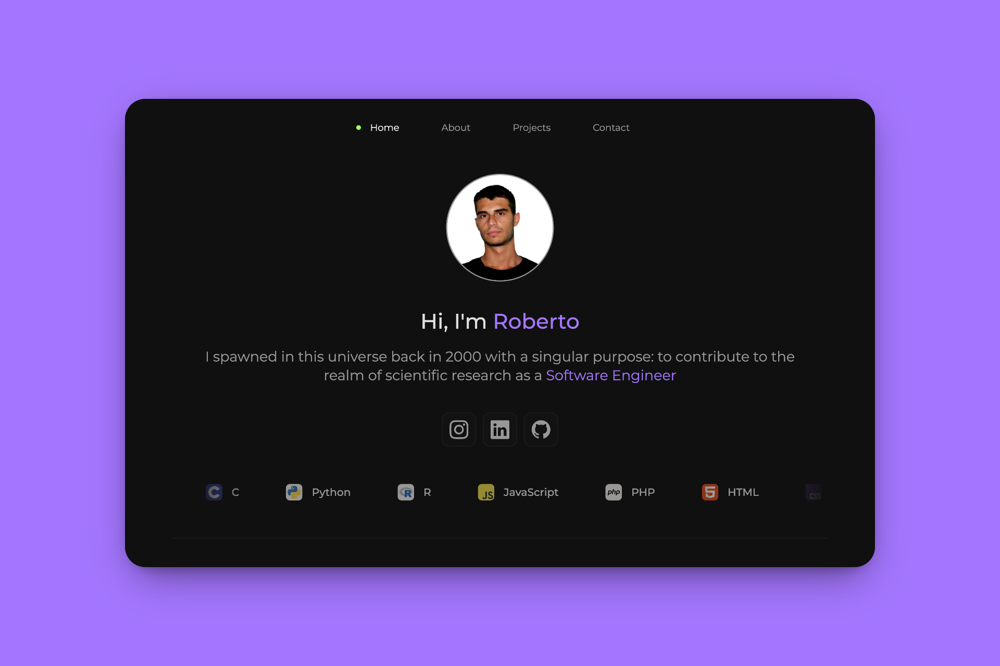

# Website: `robertovicario.com`

## Overview

This project is a personal website created using the [Astro](https://astro.build/) framework. It serves as a portfolio to showcase my work and projects.

## Prerequisites

> [!IMPORTANT]
>
> - Node.js

## User Interface (UI)

|  |
| :-: |
| **Home - Roberto Vicario** |

## Instructions

Usage:

```sh
bash cmd.sh {start|setup|build|deploy}
```

### `setup`

If you haven't set up the project yet, you can do so by running:

```sh
bash cmd.sh setup
```

Once the setup process is complete, the project will be accessible at `localhost:4321`.

> [!WARNING]
>
> If this port is already in use, search for all occurrences of `4321` within the project and replace them with your preferred port number. After making these changes, you'll need to rebuild the project for the modifications to take effect.

### `start`

The program will run in debug mode, meaning frontend changes will be rendered upon reload. However, if you make changes to the backend, you will need to restart the program by running:

```sh
bash cmd.sh start
```

### `build`

To generate the static files for the project, run the following command:

```sh
bash cmd.sh build
```

After the build process completes, the static files will be available in the `./app/dist/` directory.

### `deploy`

To deploy the application to production, you can use the following command:

```sh
bash cmd.sh deploy
```

This project leverages GitHub Actions for CI/CD. The deployment workflow is configured to automatically build the project and deploy it to the GitHub Pages environment.

## License

This project is distributed under [GNU General Public License version 3](https://opensource.org/license/gpl-3-0). You can find the complete text of the license in the project repository.
